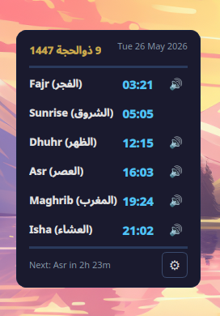
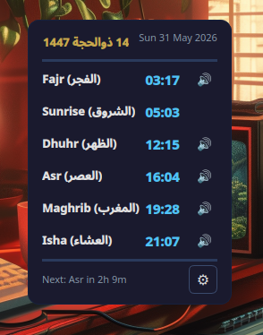
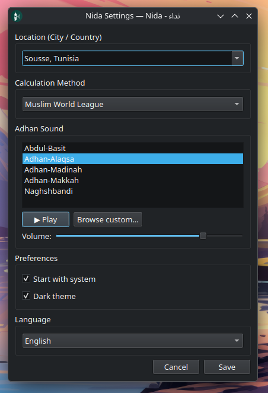

<p align="center">
  
</p>

<h1 align="center">Nida - نداء | Prayer Time App</h1>

<p align="center">
  <b>Pauses your media and notifies you at adhan time — works online and offline.</b>
</p>

---

## Screenshots

| | |
|---|---|
|  |  |
|  | |

---

## Features

- **Media pause/resume** — automatically pauses whatever you're playing (browser, Spotify, video player, anything), then resumes after you dismiss the notification
- **Prayer notification window** — a dedicated popup shows the prayer name, "لا تنسى صلاتك", and a dismiss button to stop the adhan and resume your media
- **Adhan sound** — plays automatically at prayer time, stops when you press Close
- **5 bundled adhan sounds** — plus support for custom MP3 files
- **Per-prayer toggle** — enable or disable the adhan for each prayer individually
- **Offline support** — caches prayer times in SQLite so it works without internet
- **Arabic Hijri dates** — displayed alongside the Gregorian date
- **Multiple calculation methods** — Muslim World League, Umm al-Qura, Egyptian, Karachi, etc.
- **System tray** — hover to see time until next prayer, click to open the widget
- **Autostart** — enable from Settings → Preferences → Start with system

---

## Donate

[](https://buymeacoffee.com/cheriff)

---

## Installation

### Linux

| Method | Command |
|---|---|
| **AppImage** (any distro) | `chmod +x Nida-*.AppImage && ./Nida-*.AppImage` |
| **Debian / Ubuntu** | `sudo dpkg -i nida_*.deb && sudo apt install -f` |
| **Portable tarball** | `tar xzf Nida-*.tar.gz && cd Nida-*/bin/ && ./Nida` |

#### Build from source

**Fedora:**
```bash
sudo dnf install cmake gcc-c++ qt6-qtbase-devel qt6-qtmultimedia-devel \
  qt6-qtsql-devel qt6-qtnetwork-devel qt6-qtdbus-devel
cmake -S . -B build -DCMAKE_BUILD_TYPE=Release -DCMAKE_INSTALL_PREFIX=/usr
cmake --build build --parallel
sudo cmake --install build
Nida
```

**Debian / Ubuntu:**
```bash
sudo apt install cmake g++ qt6-base-dev qt6-multimedia-dev \
  libqt6sql6 libqt6network6 qt6-base-dev-tools
cmake -S . -B build -DCMAKE_BUILD_TYPE=Release
cmake --build build --parallel
./build/Nida
```

### Windows

Download the `.exe` installer and run it — simple install process.

---

## Feedback & Contributions

If you have any notes, requests, bug reports, or ideas, feel free to open an issue or contact me. All feedback is welcome.

---

## License

MIT
